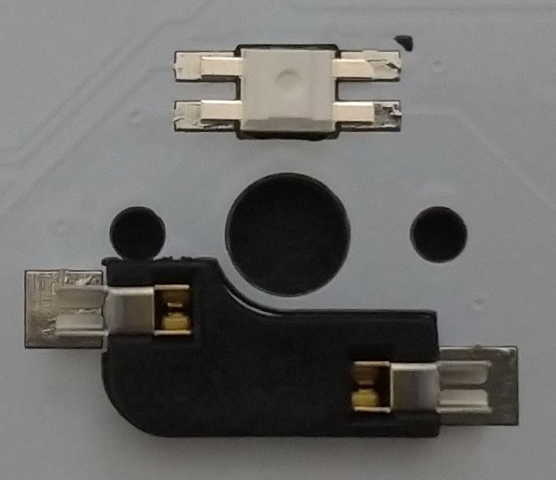

# keyboard_footprint
 
自作キーボードの基板設計に使うことができるフットプリントのライブラリです。  
KiCad 6.0で使用可能です。

## 使用方法

### シンボルライブラリ
`KiCad 6.0の設定 > シンボルライブラリを管理` から、`symbol/keyboard_Lib.kicad_sym`をライブラリに追加してください。

### フットプリント
`KiCad 6.0の設定 > フットプリントライブラリを管理` から、`keyboard.pretty`ディレクトリをライブラリに追加してください。

## 含まれるフットプリントについて

### BLE_Micro_Pro.kicad_mod  
自作キーボードでよく使われる [pro micro](https://scrapbox.io/self-made-kbds-ja/Pro_Micro)/ [BLE Micro pro](https://sekigon-gonnoc.github.io/BLE-Micro-Pro/) 両対応のフットプリントです。

### MX_Socket_LED.kicad_mod  
[Cherry MXスイッチのSocket](https://shop.yushakobo.jp/products/a01ps) と バックライトLEDD([SK6812MINI-E](https://shop.yushakobo.jp/collections/all-products/products/sk6812mini-e-10))に対応したスイッチのフットプリントです。  
こちらはリバーシブルではありません。  
LEDは表面実装ですが、裏側から取り付ける形になります。

### MX_Choc_Reversible_LED.kicad_mod
Cherry MX、Kailh Choc V1、Kailh Choc V2に対応したリバーシブルなフットプリントです。  
左右分離キーボードを設計する際に便利です。
バックライトLED([SK6812MINI-E](https://shop.yushakobo.jp/collections/all-products/products/sk6812mini-e-10))にも対応しています。  
こちらもLEDは裏側から取り付けます。

### MX-Choc-pcb-plate.kicad_mod
PCBでスイッチプレートを作成する際に使用するフットプリントです。  
JLCPCBなど一部の業者では、Edge.cutsレイヤーが複雑だと追加コストを請求されることがあります。  
本フットプリントではドリルホールにて実装しているため、追加費用を抑えることができるかもしれません。

### SK6812MINI-E-backside.kicad_mod
アンダーグローなどで、[SK6812MINI-E](https://shop.yushakobo.jp/collections/all-products/products/sk6812mini-e-10) を単独で使用する際のフットプリントです。  
こちらもLEDは裏側から取り付けます。

## ライセンス

CC0 1.0 Universal を採用しています。

コピーライト表記など不要で自由に組み込み・改変が可能です。  
もちろん商用利用して頂いて構いません。  
詳しくは以下のリンクを参照してください。

https://creativecommons.org/publicdomain/zero/1.0/